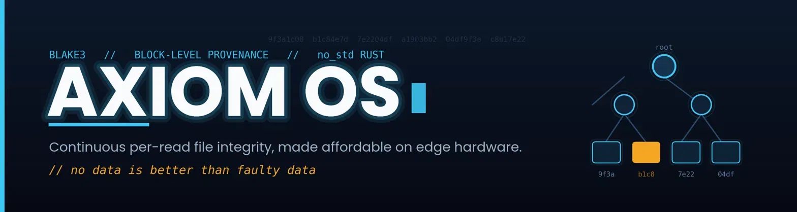
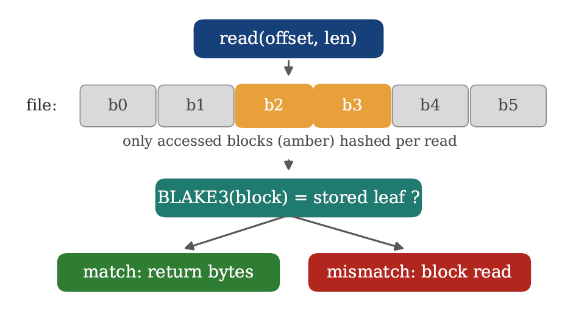

<p align="center">
  
</p>

<p align="center">
  
  
  
  
  
</p>

> This repository is the `v0.3.0-alpha` research prototype described in the manuscript
> *"Proportional-Cost Per-Read Provenance: Making Continuous File Integrity Verification Affordable on Edge Hardware,"* submitted to IEEE Embedded Systems Letters.

A bare-metal `no_std` Rust kernel that enforces BLAKE3 file-integrity provenance on **every read** — not just at load time — and makes that affordable by verifying only the file blocks a read actually touches.

> *No data is better than faulty data.*

Special Thanks goes to Prof. Subodh Kumar, IIT Delhi whose heartfelt mentroship shaped the profiling and block - level framework. 
---

## Why

Most integrity mechanisms verify **once**: at boot, at open, or when a page is first read from storage (fs-verity, dm-verity, IMA). After that, the cached in-memory copy is trusted. If something tampers with that cached page *after* the check — a memory bug, a DMA-capable peripheral, a row-hammer flip — every later read returns the corrupted bytes as authentic. This is a live class of attack (e.g. Dirty Pipe, Copy Fail).

Axiom re-verifies the in-memory data on **every read**, so that tampering is caught on the next read. The naive way to do this — re-hash the whole file each read — costs *O(file size)* per read and is impractical on small devices. Axiom makes it affordable.

## How

<p align="center">
  
</p>

- A file is split into fixed **4 KiB blocks**; each block stores its own BLAKE3 leaf hash.
- A ranged read `read_range(offset, len)` maps to the blocks it overlaps and re-hashes **only those blocks**, comparing each against its stored leaf in constant time. Per-read cost becomes *O(bytes read)*, not *O(file size)*.
- A **lazy Merkle root** over the block leaves is a single 32-byte commitment to the file; a single-block write updates one leaf and defers the root recomputation, so a write costs one block hash instead of a full rehash.

Unlike out-of-band detectors that periodically re-scan files, Axiom enforces integrity **inline** on the read path — every read is verified before its bytes are returned, leaving no detection window.

## Results

Per-read **block-level verification is constant** regardless of file size — about **2.7 µs** (x86-64) and **3.65 µs** (ARM64) — while whole-file verification grows with size. Median wall-clock times on real hardware, from the `bench-native` harness:

| File size | Blocks | x86-64 whole (ms) | x86-64 block (ms) | ARM64 whole (ms) | ARM64 block (ms) |
|-----------|-------:|------------------:|------------------:|-----------------:|-----------------:|
| 4 KiB     | 1      | 0.0035            | 0.0027            | 0.0036           | 0.0037           |
| 16 KiB    | 4      | 0.0094            | 0.0033            | 0.0143           | 0.0037           |
| 64 KiB    | 16     | 0.0339            | 0.0030            | 0.0570           | 0.0037           |
| 256 KiB   | 64     | 0.108             | 0.0027            | 0.228            | 0.0037           |
| 1 MiB     | 256    | 0.555             | 0.0027            | 0.918            | 0.0037           |
| 4 MiB     | 1024   | 2.13              | 0.0026            | 3.72             | 0.0037           |

At 4 MiB, block-level verification is **~810× cheaper** (x86-64) and **~1020× cheaper** (ARM64) than whole-file.

**Hardware:** x86-64 = Intel Core i5-5200U (Linux, `rustc` 1.96-nightly); ARM64 = Qualcomm Snapdragon 7 Gen 4 (Cortex-A720/A520), Termux on Android 16 (`rustc` 1.95). Both use `blake3` v1.8.5 with runtime SIMD.

## Architecture

- **Target:** x86_64 (primary) + ARM64 (QEMU `virt`)
- **Language:** Rust (`no_std`, no libc)
- **Release:** `v0.3.0-alpha` (research prototype)

**Provenance layer:**
- `vfs.rs` — per-block BLAKE3 leaves; `read_range` / `verify_range` (verify only touched blocks); `write_block` + lazy `merkle_root`.
- `provenance.rs` — `provenance_hash` (BLAKE3) and a constant-time comparison primitive.
- `fat32.rs` — on-disk hash store for the persistent path.
- `mitra/` — a small DSL whose `trusted_data` type routes through the verified read path.

**Kernel subsystems:** GDT/IDT, 8 MB linked-list heap, priority scheduler, per-process page tables (CR3 isolation), IPC queues, ATA PIO driver, syscall interface (INT 0x80), interactive shell.

## Quick Start

```bash
# Prerequisites
rustup component add rust-src llvm-tools-preview
rustup target add aarch64-unknown-none
cargo install bootimage
sudo apt install qemu-system-x86 qemu-system-arm nasm

# Boot x86_64 (use the bin target; plain `cargo build` also tries the ARM bin)
cargo run --bin axiom_os

# Boot ARM64 (QEMU virt)
./run_arm.sh
```

### Tamper-detection demo

Inside the booted shell:

```
trust secret hello world     # store a file + its provenance
cat secret                   # -> hello world
tamper secret                # flip a byte in memory
cat secret                   # -> READ BLOCKED: provenance violation
```

### Reproducing the benchmark numbers

`bench-native` is a `std` crate that lives inside this `no_std` kernel repo, so it inherits the kernel's bare-metal cargo config. **Build it outside the kernel tree:**

```bash
cp -r bench-native /tmp/axiom-bench && cd /tmp/axiom-bench
cargo run --release        # prints the whole-file vs block table + inline-vs-periodic comparison
```

To reproduce the in-kernel proportional *ratio* under emulation, run `bench` in the booted shell (RDTSC size sweep). In-kernel cycle counts are emulated and used only to confirm the ratio; all millisecond figures above are from real hardware.

## Threat Model

Assumes an adversary who can modify a file's in-memory bytes after they were validated, but cannot forge the stored provenance record (per-block leaves + root). Single-core, no DMA, no ring-0. Within this model, per-read verification **reduces** the TOCTOU window: bytes returned by `read()` are verified at the moment of return. It does **not** eliminate TOCTOU (corruption after a verified read is out of scope), nor address replay/splicing on persistent storage or hardware memory-integrity attacks.

## Limitations

- Boots under QEMU; a UEFI bootloader for bare-metal boot is pending.
- Single-core; SMP / multi-core verification is future work.
- BLAKE3 runs in portable mode in-kernel (no in-kernel SIMD yet); the native harness uses runtime SIMD.
- Real-hardware results use a laptop and a phone; a dedicated embedded SoC (e.g. Raspberry Pi) measurement is the immediate next step.

## Paper

- Earlier formulation (whole-file per-read, equity framing): Zenodo, Apr. 2026 — [doi:10.5281/zenodo.19387932](https://doi.org/10.5281/zenodo.19387932)

## License

Dual-licensed under [MIT](LICENSE-MIT) and [Apache-2.0](LICENSE-APACHE).